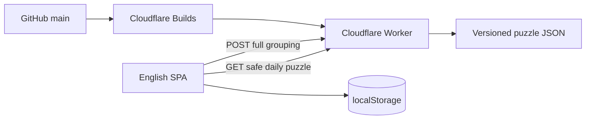

# Hidden-Rule Grouping Game 專案計畫書

| 文件項目 | 內容 |
|---|---|
| 文件版本 | 1.1 Approved — Multilingual |
| 文件日期 | 2026-08-28 |
| 核准日期 | 2026-08-28 |
| 產品名稱 | 待命名；暫稱 `Hidden-Rule Grouping Game` |
| 產品語言 | English／简体中文／Español |
| 專案類型 | Global daily browser puzzle／個人 Side Project |
| 建議週期 | 4–5 週，約 35–50 小時 |
| MVP 月費目標 | NT$0 |
| 版控／部署 | GitHub／Cloudflare Workers |
| SDLC 參考 | Planning → SA → SD/ADR → Task DAG → fixture-first → CI/Release Gate |

## 1. 執行摘要

本產品是一款支援英文、简体中文與中性拉丁美洲西班牙文的每日分類推理遊戲。每日題目顯示一個廣泛主題，例如 `Fruit`、`Animals`、`Countries` 或 `Household Objects`，以及十張屬於該主題的項目卡。畫面提供四個未命名區域，容量固定為 1、2、3、4；玩家不知道分類維度，必須找出一個能把十項唯一分割成四組的隱藏規則，再完成整張盤面。

範例：主題為 `Fruit`，隱藏維度為 `Typical outer color`，正解包含 1 red、2 yellow、3 orange、4 green fruits。解題前只顯示主題、項目與容量；完成後才揭曉規則、四個群組標籤、解釋與來源。

產品不再是 Tier List，也不沿用 Tierlistdle 名稱。它與 Connections／Stacked 同屬 hidden grouping puzzle，但核心差異是：**所有項目共享一個已知領域，所有群組由同一個隱藏分類維度產生，玩家配置整張盤面，而不是尋找多個互不相關的 connections。**

## 2. 產品定位

### 2.1 目標使用者

- 使用英文、简体中文或西班牙文的全球 daily puzzle players。
- 喜歡 Connections、Wordle、Mastermind、分類與視覺推理的玩家。
- 希望一局在 2–5 分鐘內完成的手機與桌面使用者。

### 2.2 產品承諾

`Ten items. Four hidden groups. One rule.`

### 2.3 市場差異

| 產品 | 既有機制 | 本產品差異 |
|---|---|---|
| NYT Connections | 16 個詞分成四組各四個；每組不同 connection | 同一主題、同一分類維度、群組容量不同 |
| Stacked | 15 個詞分成 1–5 大小的五組；每組不同 connection | 固定十項與 1–4 容量；整盤分類；可使用視覺項目 |
| Catalogues | 依隱藏規則排列線性順序 | 分組而非排序 |
| Sorting games | 把物件拖入已命名分類 | 分類名稱與維度皆隱藏 |

## 3. 核心玩法基線

### 3.1 每日題結構

- 1 個公開主題。
- 10 個經 locale 編審的文字、emoji 或具授權的圖像項目。
- 4 個未命名 drop zones，容量固定為 1、2、3、4。
- 1 個隱藏分類維度。
- 4 個隱藏群組標籤。
- 每個項目只能屬於一組，且完整正解須唯一。

### 3.2 建議操作流程

1. 玩家閱讀公開主題與十個隨機排列的項目。
2. 以 drag-and-drop，或 tap item → tap zone，把十項放滿四區。
3. 所有區域填滿後才可 `Check`。
4. 整盤檢查次數不限。
5. 錯誤時只回報 `X of 10 are in the correct group`，不標出是哪幾項。
6. 玩家可在任意時機使用一次提示；系統隨機把一個尚未正確固定的 item 放到正確 row 並鎖定。
7. 成功或失敗後揭曉 hidden dimension、group labels、正解與解釋。
8. 產生無雷分享結果並保存 local streak。

無限 checks、回饋粒度與玩家自選時機的一次性提示，必須在 SA Review 前以低擬真 prototype 驗證。

### 3.3 題目品質政策

可發布題目必須符合：

1. 十項都明確屬於公開主題。
2. 四組由同一個分類維度產生，不是四條獨立 connection。
3. 容量恰為 1、2、3、4。
4. 每項只有一個可辯護的 canonical group。
5. 不依賴文化刻板印象、暫時性資訊或無法驗證的主觀偏好。
6. 題目在發布 locale 中具完整解釋、必要來源與 rights note。
7. 至少一位非作者測試者未找到第二個同樣合理的完整解。

允許的分類維度包含顏色、材料、棲息地、地理區域、年代區間、字母特徵、計數特徵與科學分類。`Best`、`Most beautiful`、`Would win` 等主觀 Tier List 軸不納入 MVP。

### 3.4 題目資料最小契約

```text
puzzleId
publishDate
timezone
locale: en | zh-Hans | es-419
theme
items[10]: { itemId, label, visual?, groupId, rightsNote? }
hiddenDimension
groups[4]: { groupId, label, capacity: 1 | 2 | 3 | 4 }
hint
explanation
sources[]
difficulty
status: draft | reviewed | scheduled | retired
```

公開題面 API 不得包含 `groupId`、`hiddenDimension`、group labels、hint 或未揭曉 explanation。

## 4. MVP 範圍

### 4.1 納入

- `en`、`zh-Hans`、`es-419` UI、題目、提示、錯誤訊息與分享文字。
- 事實型題目可共用 canonical mapping 後人工在地化；拼字、文字與文化型題目必須有 locale-specific puzzle，不得直接機器翻譯。
- 每日一題、教學題、完成與失敗流程。
- 固定十項、四區、1／2／3／4 容量。
- Drag-and-drop 與等價的 tap／keyboard 操作。
- 整盤不限次數檢查、任意時機可用一次的提示、揭曉與分享。
- Local streak、今日進度、dark mode、reduced-motion。
- 題庫 JSON schema、驗證命令、唯一解 Review 與至少 30 題 buffer。
- Worker API、健康檢查、CI、Preview 與 Production 部署。
- Privacy、sources、rights、how-to-play 與 accessibility 說明。

### 4.2 排除

- 帳號、排行榜、多人房間與跨裝置同步。
- UGC、留言、審核後台與 CMS。
- AI 生成題目、AI 判分、Embedding 或聊天功能。
- 原生 App、推播、廣告、付費與完整歷史題庫。
- 未授權品牌 Logo、影視／遊戲角色圖與大量第三方照片。
- 主觀分級題與一題多個不相干的分類規則。

## 5. 高階解決方案

### 5.1 建議技術方向（待 SD 以 ADR 核准）

- TypeScript、React、Vite、Cloudflare Vite plugin。
- Cloudflare Worker + Static Assets，同一部署提供 SPA 與 `/api/*`。
- Repository 內版本化 JSON 題庫；建置時驗證 schema、容量與日期。
- Worker 回傳安全題面並在 server side 檢查完整配置。
- `localStorage` 保存 streak、當日配置、checks、hint 與偏好。
- Unit/API tests + Playwright E2E／mobile viewport。



### 5.2 API 概念邊界

| Endpoint | 用途 |
|---|---|
| `GET /api/health` | 部署、題庫版本與今日題狀態 |
| `GET /api/v1/puzzles/today` | Safe theme、items、capacities 與 checks policy |
| `POST /api/v1/puzzles/{puzzleId}/check` | 接收完整 item → row mapping，回傳 correct count／solved |
| `POST /api/v1/puzzles/{puzzleId}/hint` | 符合條件才回傳一次提示，不預載到 client |
| `POST /api/v1/puzzles/{puzzleId}/reveal` | 完成／玩家主動揭曉後取得解答；MVP 不把它當防作弊安全邊界 |

MVP 無 server session，因此不能阻止刻意作弊；目標是避免一般玩家意外從 bundle 或初始 API 看到答案。排行榜若加入，需另做 session、濫用防護與資料庫。

## 6. SDLC 與時程

| 階段 | 交付物 | Gate |
|---|---|---|
| Planning | `docs/01-project-plan.md` | 定位、範圍、服務與 rework 風險核准 |
| SA | `docs/02-system-analysis.md`、Use Cases、FR/NFR、回饋實驗、題目政策 | 玩法公平且可驗收 |
| SD | `docs/03-system-design.md`、架構、API、schema、ADR、Task DAG | 技術與依賴可執行 |
| Development | Issues、feature branches、fixtures、程式與測試 | 單一交付物且 CI 通過 |
| Content Integration | 30 題、盲測、sources／rights | 無歧義與第二解問題 |
| Release | Production、報告、Release Notes、`v1.0.0` | DoD 完成 |

| 里程碑 | 時程 | 完成定義 |
|---|---|---|
| M1 Planning + prototype | 第 1 週 | 用 5–10 題測試 feedback、checks 與 hint |
| M2 SA + SD + foundation | 第 2 週 | 需求、ADR、Task DAG、Repo、CI、Worker/SPA skeleton |
| M3 Core game | 第 3 週 | 分組、check、hint、reveal、share 與 local state |
| M4 Content + QA | 第 4 週 | 30 題、mobile、keyboard、accessibility、E2E |
| M5 Release buffer | 第 5 週 | Production smoke、修正、文件與 v1.0.0 |

題庫不足時先做 private beta，不以未 Review 題目填滿發布日程。

## 7. GitHub 工作方式

- Repo 暫緩命名，不使用 `tierlistdle`。
- `main`：Production；`dev`：Integration／Preview。
- `feature/<task-id>-<slug>`、`fix/<slug>`、`test/<slug>`：單一 Task。
- PR 進 `dev` 前須通過 CI；Release PR 由 `dev` 進 `main`。
- Project：`Backlog → Ready → In Progress → Review → Done`。
- Issue 必填 Goal、Input contract、Output artifact、Out of scope、Acceptance checks、depends_on、evidence path。
- `artifacts/session-summaries/Progress.md` 為 ignored handoff，不另建同用途進度檔。

## 8. 測試與 Release Gate

| 層級 | 驗證內容 |
|---|---|
| Contract | Puzzle schema、安全 projection、10 項與 1–4 容量 |
| Unit | 日期、shuffle、mapping、correct count、attempts、hint、share、streak |
| Puzzle validation | item 唯一、group 容量、內容、sources、rights |
| API | 題面不洩漏、mapping、check、hint、reveal、無今日題 |
| UI/E2E | Drag、tap、keyboard、mobile、重載、win/loss、換日 |
| Human review | 非作者檢查理解度、歧義、第二解與文化偏差 |

Release Gate：

1. Typecheck、lint、unit、API、build、E2E 全部通過。
2. 初始 client bundle 與 safe API 不含解答、dimension 或 group labels。
3. 至少 30 題通過 schema、人工 Review、rights Review 與非作者盲測。
4. Latest Chrome、Firefox、Safari 可用；320px 寬起可完成遊戲。
5. 不使用滑鼠也能完成全部操作。
6. Production health 與完整 win/loss 流程通過 smoke test。
7. Privacy、rights、README、題目編輯、排程、rollback、Release Notes 完整。

## 9. 外部服務

### 開工即需要

| 服務 | 用途 | 連接 |
|---|---|---|
| GitHub | Repo、Issues、Project、PR、Actions、Releases | 若要 Codex 管理，連接 GitHub plugin |
| Cloudflare | Worker、Static Assets、Preview/Production、Web Analytics | 安裝 Cloudflare GitHub App；若要 Codex 部署，連接 Cloudflare plugin |

Production branch 設為 `main`；`dev` 與 feature PR 使用 Preview。首發使用不需購買網域的 `tensift.pages.dev`。

### MVP 不需要

- OpenAI、Workers AI、Embedding 或其他 AI API。
- Supabase、Firebase、D1、登入服務、Airtable、Notion CMS。
- R2，除非圖片無法合理隨 build 發布。
- Sentry／PostHog，beta 後再決定。
- Turnstile，只有 UGC、帳號、排行榜或濫用後才需要。

## 10. 主要風險

| ID | 風險 | 機率／衝擊 | 預防與應對 |
|---|---|---|---|
| R1 | 第二個同樣合理的完整解 | 高／高 | 單一維度、canonical mapping、非作者盲測；有爭議即退回 Draft |
| R2 | 玩家理解正確但項目邊界模糊 | 高／高 | 明確措辭與來源；避開主觀或「通常」但不穩定的屬性 |
| R3 | 回饋太少像瞎猜，太多則一次破解 | 高／高 | 比較 correct-count、per-row、lock-one prototype |
| R4 | 1-item group 缺乏資訊 | 中／中 | 應能由容量與其他三組排除；以盲測驗證 |
| R5 | 圖片／Logo／角色侵權 | 中／高 | Text／emoji-first；自製或明確授權；保存 rights note |
| R6 | 答案從前端洩漏 | 中／中 | Worker safe projection；CI 掃描 bundle 與 API fixture |
| R7 | Drag 在手機／無障礙環境失效 | 中／高 | 同步提供 tap-to-place、keyboard 與 focus state |
| R8 | 英文題目仍過度依賴單一文化 | 中／中 | 首版偏普遍實物、科學、地理；Review 文化範圍 |
| R9 | 題庫速度跟不上每日發布 | 高／高 | Release 前 30 題 buffer；authoring template + checklist |
| R10 | 被視為 Stacked clone | 中／高 | 同領域、單一維度、整盤配置、視覺互動與獨立品牌 |

## 11. 開工前必須核准的 Rework 決策

1. 公開 `theme`，隱藏 dimension 與 group labels。
2. 固定 10 items、4 zones、capacities 1／2／3／4。
3. 填滿整盤後一次 `Check`，不逐組 submit。
4. 建議錯誤只顯示 `X/10 correct`；prototype 後定案。
5. Check 次數不限；記錄失敗次數供結果與分析使用。
6. 玩家可在任意時機使用一次提示：隨機將一個尚未正確固定的 item 放到正確 row 並鎖定；分享結果標記 hint。
7. 首發支援 `en`、`zh-Hans`、`es-419`；跨主題、每題單一客觀分類維度。
8. Text + emoji-first；一致插畫留到玩法驗證後。
9. 三語全球產品暫以 UTC 00:00 統一換題。
10. 答案留在 Worker；local streak 不作競技可信紀錄。
11. 建 Repo、網域與品牌前先完成命名與基本撞名檢查。

## 12. Definition of Done

1. Production 可在三種首發 locale 完成今日題的配置、檢查、提示、揭曉與分享。
2. 重載可恢復配置、checks、hint 與 local streak。
3. 題庫、API、日期、mapping、feedback、狀態契約有自動測試。
4. 30 題 Reviewed buffer 具唯一正解、解釋、來源與 rights note。
5. CI、Preview、Production smoke 與 Release Gate 通過。
6. `main` 建立 `v1.0.0`；README、How to Play、Privacy、Rights、authoring、rollback 完整。
7. 無未處理 Critical／High 缺陷；已知限制列入 Release Notes。

## 13. 核准後下一步

1. 建立 5–10 題低擬真 prototype，驗證 feedback、checks、hint 與唯一解。
2. 產品命名，做網域、搜尋與 Repo 基本撞名檢查。
3. 建立 GitHub Repo、`main`／`dev`、Project、Milestone、labels、branch protection。
4. 將本文件存為 `docs/01-project-plan.md`。
5. 撰寫 SA，建立 Use Cases、FR/NFR、題目政策與驗收案例。
6. 撰寫 SD，以 ADR 核准 React/Vite/Worker、API、schema、UTC、快取與 Task DAG。
7. 連接 Cloudflare 與 GitHub，部署最小 health + SPA Preview。
