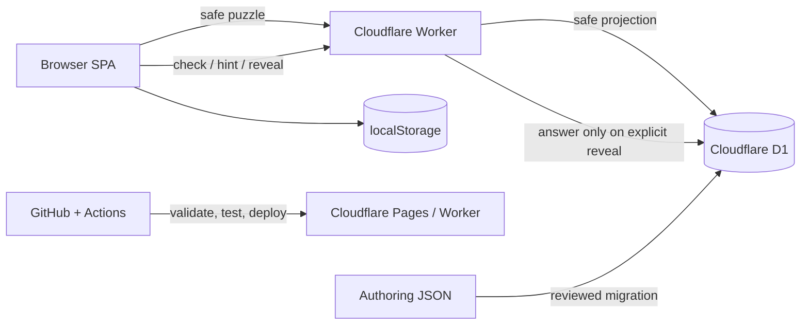

# Tensift SA / Production Design

Status: Draft for review  
Date: 2026-08-29  
Baseline: approved prototype in [`index.html`](../index.html)

This document turns the approved prototype into a buildable production design. It does not change the frozen gameplay contract: ten items, four unlabeled rows with capacities 1 / 2 / 3 / 4, unlimited checks, one optional hint, and explicit reveal.

## 1. Goals and non-goals

### Goals

- Serve one daily puzzle in English (`en`), Simplified Chinese (`zh-Hans`), and neutral Latin American Spanish (`es-419`).
- Keep the answer out of the initial HTML, JavaScript bundle, and safe puzzle response.
- Preserve the prototype's local, no-account play model.
- Make puzzle authoring, review, localization, and release repeatable.
- Make the gameplay contract testable before UI implementation begins.

### Non-goals for v1

- Accounts, rankings, multiplayer, cross-device sync, UGC, or an authoring CMS.
- Perfect anti-cheat. A player who intentionally calls the reveal endpoint or probes a check oracle can still discover the answer; the goal is to prevent accidental leakage and casual scraping.
- AI-generated or AI-judged puzzles.

## 2. System context



The browser owns presentation and a resumable local session. The Worker is the public API and the only production component allowed to read the authoritative solution. D1 is the recommended production store because it supports scheduled puzzles, locale variants, review status, and migrations without putting answer data in a public static asset. A checked-in JSON fixture remains the local-development adapter.

### Environments

| Environment | Purpose | Data policy |
|---|---|---|
| Local | UI and contract development | Fixture JSON; no real secrets |
| Preview | Pull-request smoke and content review | Isolated D1 database or seeded preview fixture |
| Production | Daily public game | Production D1; safe responses edge-cacheable |

The first release should use one UTC rollover (`00:00 UTC`) for all locales. A localized rollover is a product change and requires a new ADR because it changes streak and cache semantics.

## 3. Domain model

| Entity | Required fields | Invariants |
|---|---|---|
| `PuzzleFamily` | `puzzleFamilyId`, canonical topic, provenance | Groups the same authored idea across locales; not necessarily translatable word-for-word |
| `LocalePuzzle` | `puzzleId`, `puzzleFamilyId`, `locale`, `publishDate`, `theme`, `items`, `rows`, `solution` | Exactly ten unique items; exactly four rows; capacities are 1, 2, 3, 4; one complete solution |
| `PuzzleItem` | `itemId`, `label`, optional `visual`, optional `rightsNote` | Item belongs to the public theme and has one canonical solution group |
| `SolutionGroup` | `groupId`, hidden dimension, `label`, `capacity`, `itemIds` | Four groups partition all ten items; group capacities match rows |
| `GameSession` | `puzzleId`, `locale`, `placements`, `attempts`, `hintUsed`, timestamps | Client-resumable UX state; never a trusted competitive record |
| `AnalyticsEvent` | event name, `puzzleId`, locale, coarse metrics, timestamp | No answer mapping, free-form item text, IP, or account identifier |

### Session state

```text
GameSession {
  schemaVersion: 1
  puzzleId: string
  locale: en | zh-Hans | es-419
  placements: { [rowId: string]: string[] }
  attempts: number
  hintUsed: boolean
  solved: boolean
  startedAt: ISO-8601
  completedAt?: ISO-8601
}
```

Persist this state under `tensift:v1:session:{locale}:{puzzleId}`. `placements` contains item IDs and public row IDs only; it must not contain `groupId`, `hiddenDimension`, or answer labels. A random `clientSessionId` may be sent with API calls for idempotency and analytics correlation, but it is not an authentication credential.

## 4. Locale and content model

The first release has three explicit locales: `en`, `zh-Hans`, and `es-419`. Each `LocalePuzzle` is authored and reviewed in its target language.

- A factual puzzle may share a `puzzleFamilyId` across locales, but labels, explanations, sources, and difficulty notes are locale-specific records.
- Spelling, wordplay, culturally specific examples, and text-count rules must be separate locale puzzles; they must not be machine-translated from another locale.
- The API never silently falls back to another language. If a locale is unavailable, it returns `LOCALE_NOT_AVAILABLE` and the client offers an explicit locale switch.
- `itemId` and `groupId` are stable opaque IDs. They are not user-facing translations and must not encode the answer.

## 5. Authoring schema and validation

The authoring contract is [`puzzle.schema.json`](./puzzle.schema.json). It intentionally contains the solution because it is an internal source file; the release pipeline must project it into a public DTO before it is reachable by the browser.

Schema validation is necessary but not sufficient. The validator must also enforce these cross-field rules:

1. Every `solution.groups[].itemIds[]` references one existing item exactly once.
2. The four group capacities are exactly 1, 2, 3, and 4, and each group item count equals its capacity.
3. The solution dimension is one shared objective dimension, not four unrelated connections.
4. All ten items are in the public theme and have one defensible canonical group.
5. `publishDate`, locale, source, rights, and review status are complete before scheduling.
6. A non-author blind test finds no second complete solution that is equally defensible.

The CI validator should fail closed on any invariant violation. The authoring schema requires a valid `publishDate` even for drafts; only `scheduled` and `published` records are eligible for release.

## 6. Public DTO and answer-leakage boundary

### Safe puzzle response

`GET /api/v1/puzzles/today?locale=en` returns only:

```json
{
  "apiVersion": 1,
  "puzzle": {
    "puzzleId": "puz_2026_09_01_en_001",
    "publishDate": "2026-09-01",
    "locale": "en",
    "theme": "Countries",
    "items": [
      {"itemId": "country-jp", "label": "Japan"}
    ],
    "rows": [
      {"rowId": "row-1", "capacity": 1},
      {"rowId": "row-2", "capacity": 2},
      {"rowId": "row-3", "capacity": 3},
      {"rowId": "row-4", "capacity": 4}
    ],
    "policy": {"maxHints": 1, "checks": "unlimited"}
  }
}
```

The safe DTO must not contain `solution`, `groupId`, `hiddenDimension`, group labels, explanation, sources, or hint placement. The Worker reads the complete record from D1 and constructs this DTO explicitly; it must never serialize the internal row unchanged.

### Reveal response

`POST /api/v1/puzzles/{puzzleId}/reveal` is `Cache-Control: no-store` and is called only after an explicit user action (or a solved state). It may return the hidden dimension, four group labels, item membership, explanation, sources, and rights notes. Reveal is a UX boundary, not a cryptographic anti-cheat boundary.

### Build and runtime checks

- Do not import authoring JSON into the browser build.
- Scan the browser bundle and safe API fixture for known solution IDs and answer labels.
- Add an API contract test that asserts the forbidden fields are absent from `today`, `check`, and `hint` responses.
- Keep reveal data behind a Worker binding or server-side query; never publish it as `/assets/*.json`.

## 7. API contract

All endpoints are versioned under `/api/v1`, return JSON, and include a request ID. Error bodies use `{ "code": string, "message": string, "requestId": string }`.

| Method and path | Request | Success response | Cache |
|---|---|---|---|
| `GET /api/health` | none | `{status, release, puzzleCatalogVersion}` | `no-store` |
| `GET /api/v1/puzzles/today?locale={locale}` | locale query | safe puzzle DTO | short edge cache; vary by locale |
| `POST /api/v1/puzzles/{id}/check` | `{clientSessionId, placements}` | `{correctCount, solved, attemptAccepted}` | `no-store` |
| `POST /api/v1/puzzles/{id}/hint` | `{clientSessionId, idempotencyKey, placements?, lockedItemIds?}` | `{itemId, rowId, hintAccepted}` | `no-store` |
| `POST /api/v1/puzzles/{id}/reveal` | `{clientSessionId}` | answer DTO | `no-store` |

`placements` is an array of `{itemId, rowId}` pairs. The Worker rejects duplicate items, unknown IDs, wrong row capacities, and incomplete boards with `INVALID_PLACEMENT` or `BOARD_INCOMPLETE`. `check` returns only the exact correct-item count and `solved`; it does not identify incorrect items or expose group IDs.

The prototype remains playable offline with a fixture adapter. When the production API is unavailable, the client should show a recoverable error and preserve local state; it must not silently substitute a different day's puzzle.

### Error codes

`PUZZLE_NOT_FOUND`, `LOCALE_NOT_AVAILABLE`, `INVALID_PLACEMENT`, `BOARD_INCOMPLETE`, `HINT_ALREADY_USED`, `HINT_NOT_AVAILABLE`, `REVEAL_NOT_AVAILABLE`, `REQUEST_TOO_LARGE`, `RATE_LIMITED`, `INTERNAL_ERROR`.

## 8. Privacy and analytics

No account or personal profile is required. The default product can ship with Cloudflare Web Analytics or no analytics. If event-level funnel analysis is needed, add PostHog only after a privacy decision and consent copy review.

Allowed coarse events:

- `puzzle_viewed`: puzzle ID, locale, viewport class.
- `board_checked`: puzzle ID, locale, attempt number bucket, correct-count bucket.
- `hint_used`: puzzle ID, locale.
- `reveal_used`: puzzle ID, locale, solved state.
- `puzzle_completed`: puzzle ID, locale, attempts bucket, hint used, duration bucket.
- `locale_changed`: from/to locale.

Do not send placements, hidden dimensions, group labels, item free text, IP addresses, or an advertising identifier. Keep event retention short and document it in the privacy page. Analytics must never be a gameplay dependency.

## 9. Non-functional requirements

- **Accessibility:** keyboard/tap parity, visible focus, labelled rows, `aria-live` feedback, reduced-motion support, and completion without drag-and-drop.
- **Performance:** safe daily puzzle available on a cold mobile load without waiting for analytics; cache only non-sensitive DTOs.
- **Reliability:** health endpoint, graceful API errors, idempotent hint/reveal calls, and rollback to the previous Worker release.
- **Security:** no secrets in the client; strict Content Security Policy; allowlisted origins; request-size limits; abuse rate limits that do not impose a gameplay attempt limit.
- **Internationalization:** all UI strings and result copy come from locale dictionaries; dates and plural forms use locale-aware formatting.
- **Content quality:** every published puzzle has sources, rights notes where applicable, a difficulty review, and a second-solution review.

## 10. Delivery and release architecture

### Required at project start

| Service | Role | Recommendation |
|---|---|---|
| GitHub | repository, Issues/Project, pull requests, Actions, releases | Required |
| Cloudflare Pages + Worker | SPA hosting, API, previews, production | Required |
| Cloudflare D1 | private authoritative puzzle records and release status | Recommended for production; fixture adapter is enough locally |

### Optional / defer

| Service | Trigger |
|---|---|
| Cloudflare DNS / Registrar | Only after product name and domain are chosen |
| Cloudflare R2 | Only when image assets need storage outside the build |
| PostHog | Only when event-level analytics has privacy approval |
| Sentry | Add when beta traffic makes client error triage worthwhile |
| Turnstile | Only if public abuse, UGC, accounts, or rankings appear |
| Supabase / Firebase / auth provider | Not needed for the no-account MVP |

GitHub Actions should run schema validation, cross-field puzzle checks, unit tests, API contract tests, bundle leak scans, and a production build on every pull request. Merges to `dev` deploy a preview; a release pull request from `dev` to `main` deploys production. Store only `CLOUDFLARE_API_TOKEN`, `CLOUDFLARE_ACCOUNT_ID`, and D1 database identifiers as repository secrets; never commit their values.

## 11. Rework risks requiring product sign-off

These choices affect implementation cost or future migration. The recommendation is recorded, but they should be confirmed before the first production code task.

| Decision | Recommended default | Rework if changed later |
|---|---|---|
| Answer authority | Worker + private D1; fixture adapter locally | Moving from static client answers to server authority changes API, tests, and deployment |
| Release rollover | `00:00 UTC` for all locales | Local midnight changes streak, cache keys, scheduling, and support rules |
| Locale content | Independent authored `en`, `zh-Hans`, `es-419` records | Runtime translation fallback would require new content and QA contracts |
| Attempts | Unlimited UX checks; no trusted leaderboard statistic | Accounts/rankings require sessions, abuse controls, and durable event storage |
| Analytics | None or privacy-reviewed PostHog later | Adding analytics after launch changes consent, event contracts, and retention policy |
| Visual assets | Text/emoji-first | Image rights, R2, CDN, alt text, and moderation add a content pipeline |

## 12. Next implementation package

1. Confirm the sign-off table above and record changes as ADRs.
2. Add a TypeScript project skeleton while preserving the current `index.html` as the visual reference.
3. Implement schema and cross-field validators with fixtures for valid, ambiguous, and leaking puzzles.
4. Build the safe DTO projection and Worker contract tests before wiring UI data fetching.
5. Add D1 migration/seed scripts and a local fixture adapter.
6. Configure GitHub Actions and Cloudflare preview deployment.
7. Migrate the approved gameplay one slice at a time; any rule change requires a new ADR and prototype review.
