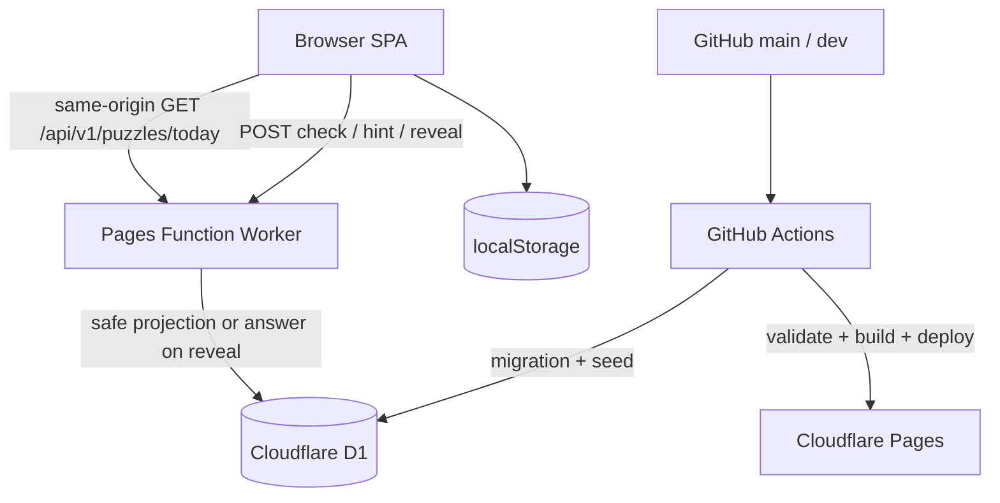

# Tensift System Design

Status: Draft for implementation review  
Date: 2026-08-29  
Inputs: [SA / production design](./sa-production-design.md), [ADR-0001](./adr-0001-server-authoritative-answer-boundary.md), [ADR-0002](./adr-0002-locale-authored-content.md)  
Reference UI: [`index.html`](../index.html)

This document describes how to implement the approved Tensift rules. It is intentionally narrower than the SA: it defines module boundaries, durable data, request/response contracts, state transitions, deployment, and test gates. It does not change the gameplay baseline.

## 1. Frozen product contract

The implementation MUST preserve these behaviors until a new ADR and prototype review are approved:

- One public theme and ten items.
- Four unlabeled rows with capacities 1 / 2 / 3 / 4.
- One shared hidden classification dimension and one unique complete solution.
- The board must be full before `Check`.
- Checks are unlimited; `Attempts` increments for every accepted check, including a successful check.
- One `Hint` is available at any time. It places and locks one random eligible item in its correct row.
- `Reveal answer` is explicit, returns the answer in a closable dialog, and is not a secrecy boundary after the click.
- Locales are `en`, `zh-Hans`, and `es-419`; content is authored per locale.

## 2. Target architecture

### 2.1 Deployment topology

The canonical production deployment is one Cloudflare Pages project with a Pages Function Worker under `/api/*`. The same origin serves the Vite-built SPA and API, avoiding browser CORS configuration. The Function has a private D1 binding. If traffic or team structure later requires a separate Worker, the API contract remains unchanged.



### 2.2 Runtime responsibilities

| Component | Owns | Must not own |
|---|---|---|
| Browser SPA | Rendering, input, local session, locale preference, UX copy | Authoritative answer, trusted score, secrets |
| Domain engine | Pure placement validation, correct-count calculation, hint candidate selection | HTTP, DOM, database calls |
| API client | Typed fetch, timeout, error decoding, fixture adapter | UI state mutation or answer interpretation |
| Pages Function | Auth-free request validation, puzzle lookup, safe projection, check/hint/reveal orchestration | Rendering or localized UI strings |
| D1 repository | Puzzle and source persistence, release selection, short-lived idempotency receipts | Public DTO construction |
| Content validator | Schema and cross-field invariants, leak fixtures, unique-solution gate | Publishing unreviewed data |

### 2.3 Proposed repository layout

```text
src/
  app/                         # bootstrap, router, dependency wiring
  domain/
    puzzle/                    # IDs, capacities, pure puzzle contracts
    game/                      # placements, attempts, hint, result reducer
  api/
    contracts.ts               # public DTOs and error contracts
    client.ts                  # browser fetch adapter
    fixtureClient.ts           # local/offline adapter
  features/
    game-board/                # board and item interactions
    result-dialog/             # reveal and completion dialog
    settings/                  # locale and accessibility preferences
  i18n/                        # en, zh-Hans, es-419 dictionaries
  styles/
worker/
  index.ts                     # Pages Function entry and route table
  routes/                      # health, today, check, hint, reveal
  repositories/d1PuzzleRepo.ts
  services/safeProjection.ts
  services/actionReceipts.ts
content/puzzles/{locale}/*.json
migrations/*.sql
scripts/validate-puzzles.ts
scripts/scan-public-bundle.ts
tests/
  unit/
  contract/
  e2e/
```

The current single-file prototype remains the visual and interaction reference during migration. New production modules should not import the prototype's inline data or answer mapping.

## 3. Runtime flows

### 3.1 Bootstrap and resume

1. Determine the requested locale from the saved preference, then browser language, then `en`.
2. Request `GET /api/v1/puzzles/today?locale={locale}`.
3. Validate the response against the safe DTO contract before rendering.
4. Load `tensift:v1:session:{locale}:{puzzleId}` from localStorage.
5. Discard only malformed or schema-incompatible local state; preserve a recoverable error message and never substitute another puzzle.
6. Render shuffled items and rows. Shuffling is display-only and must not affect item IDs.

### 3.2 Check

1. The UI guard rejects a check while any row is under capacity or an item is unplaced.
2. The domain engine validates that every item appears exactly once and every row has its declared capacity.
3. The client sends `{clientSessionId, placements}` to the Worker.
4. The Worker validates IDs and row capacities, loads the internal membership map, and calculates the number of items whose canonical group capacity equals the submitted row capacity.
5. The response contains only `correctCount`, `solved`, and `attemptAccepted`; it does not identify incorrect items or return group IDs.
6. On an accepted response, the client increments `attempts`, persists the session, and announces localized feedback.

### 3.3 Hint

1. The client rejects a second hint locally and sends a new idempotency key for the first request.
2. The Worker finds eligible items that are not locked and are not already in their correct row, chooses one with a cryptographically secure random source, and writes an anonymous action receipt.
3. The response contains only `{itemId, rowId, hintAccepted}`.
4. The client moves the item, marks it locked, sets `hintUsed`, persists, and announces the placement.

The request always includes `clientSessionId` and `idempotencyKey`. It may also include the current public `placements` and `lockedItemIds` snapshot so the Worker can avoid hinting an item that is already correctly placed; omitted snapshots are treated as an empty board. The receipt prevents a network retry from producing two different hints for the same `clientSessionId`. It does not prevent a malicious player from inventing new session IDs; there is no trusted competitive statistic in v1.

### 3.4 Reveal and completion

`POST /api/v1/puzzles/{id}/reveal` is sent only after an explicit click or a solved state. The Worker queries the internal solution and returns the reveal DTO with `Cache-Control: no-store`. The client opens a modal with an explicit close button and Escape handling. Closing the modal never resets the board or local session.

### 3.5 Rollover and API failure

- The Worker chooses today's record using `publishDate` in UTC and `status` in (`scheduled`, `published`).
- A puzzle ID, not a date alone, keys local state so a locale or content correction cannot overwrite an earlier session.
- A failed API request preserves the local board and offers retry. It must not silently load a different date, locale, or fixture in production.

## 4. Type and contract design

Public contracts are explicit DTOs. Internal authoring and D1 records are different types and are transformed at the Worker boundary.

```ts
export type Locale = 'en' | 'zh-Hans' | 'es-419';
export type RowId = `row-${1 | 2 | 3 | 4}`;

export interface SafePuzzleItem {
  readonly itemId: string;
  readonly label: string;
  readonly visual?: {
    readonly type: 'emoji' | 'image';
    readonly src: string;
    readonly altText: string;
  };
}

export interface SafePuzzleDto {
  readonly puzzleId: string;
  readonly publishDate: string;
  readonly locale: Locale;
  readonly theme: string;
  readonly items: readonly SafePuzzleItem[];
  readonly rows: readonly { rowId: RowId; capacity: 1 | 2 | 3 | 4 }[];
  readonly policy: { maxHints: 1; checks: 'unlimited' };
}

export interface Placement {
  readonly itemId: string;
  readonly rowId: RowId;
}

export interface CheckRequest {
  readonly clientSessionId: string;
  readonly placements: readonly Placement[];
}

export interface CheckResponse {
  readonly correctCount: number;
  readonly solved: boolean;
  readonly attemptAccepted: true;
}

export interface HintResponse {
  readonly itemId: string;
  readonly rowId: RowId;
  readonly hintAccepted: true;
}
```

The reveal DTO is intentionally separate and is never a subtype of `SafePuzzleDto`:

```ts
export interface RevealGroup {
  readonly label: string;
  readonly capacity: 1 | 2 | 3 | 4;
  readonly itemIds: readonly string[];
}

export interface RevealResponse {
  readonly hiddenDimension: string;
  readonly groups: readonly RevealGroup[];
  readonly explanation: string;
  readonly sources: readonly { title: string; url: string }[];
}
```

### Contract rules

- `SafePuzzleDto` MUST be constructed field-by-field; do not spread a D1 or authoring record into it.
- `placements` MUST contain ten unique known item IDs and one valid row ID per item.
- `correctCount` is between 0 and 10. The response never includes per-item correctness.
- `HintResponse` is returned once per anonymous session and puzzle; a repeated idempotent request returns the same response.
- All error bodies are `{code, message, requestId}`. Messages are safe for logs and are localized only by the client.

## 5. D1 data design

The authoring JSON is the source-of-truth format for review. A seed command validates it, then writes normalized rows to D1. Answers stay in D1 and are never copied to `dist/`.

### 5.1 Tables

```sql
CREATE TABLE puzzles (
  puzzle_id TEXT PRIMARY KEY,
  puzzle_family_id TEXT NOT NULL,
  locale TEXT NOT NULL CHECK (locale IN ('en', 'zh-Hans', 'es-419')),
  publish_date TEXT NOT NULL,
  timezone TEXT NOT NULL DEFAULT 'UTC' CHECK (timezone = 'UTC'),
  status TEXT NOT NULL CHECK (status IN ('draft', 'reviewed', 'scheduled', 'published', 'retired')),
  theme TEXT NOT NULL,
  hidden_dimension TEXT NOT NULL,
  explanation TEXT NOT NULL,
  difficulty_band TEXT NOT NULL CHECK (difficulty_band IN ('easy', 'medium', 'hard')),
  difficulty_score REAL NOT NULL CHECK (difficulty_score >= 0 AND difficulty_score <= 1),
  hint_policy TEXT NOT NULL DEFAULT 'random-unlocked-correct-row',
  max_hints INTEGER NOT NULL DEFAULT 1 CHECK (max_hints = 1),
  created_at TEXT NOT NULL,
  updated_at TEXT NOT NULL,
  UNIQUE (locale, publish_date)
);

CREATE TABLE puzzle_items (
  puzzle_id TEXT NOT NULL,
  item_id TEXT NOT NULL,
  label TEXT NOT NULL,
  visual_json TEXT,
  rights_note TEXT,
  display_order INTEGER NOT NULL,
  PRIMARY KEY (puzzle_id, item_id),
  FOREIGN KEY (puzzle_id) REFERENCES puzzles(puzzle_id) ON DELETE CASCADE
);

CREATE TABLE puzzle_rows (
  puzzle_id TEXT NOT NULL,
  row_id TEXT NOT NULL,
  capacity INTEGER NOT NULL CHECK (capacity IN (1, 2, 3, 4)),
  PRIMARY KEY (puzzle_id, row_id),
  UNIQUE (puzzle_id, capacity),
  FOREIGN KEY (puzzle_id) REFERENCES puzzles(puzzle_id) ON DELETE CASCADE
);

CREATE TABLE solution_groups (
  puzzle_id TEXT NOT NULL,
  group_id TEXT NOT NULL,
  label TEXT NOT NULL,
  capacity INTEGER NOT NULL CHECK (capacity IN (1, 2, 3, 4)),
  display_order INTEGER NOT NULL,
  PRIMARY KEY (puzzle_id, group_id),
  UNIQUE (puzzle_id, capacity),
  FOREIGN KEY (puzzle_id) REFERENCES puzzles(puzzle_id) ON DELETE CASCADE
);

CREATE TABLE solution_group_items (
  puzzle_id TEXT NOT NULL,
  group_id TEXT NOT NULL,
  item_id TEXT NOT NULL,
  PRIMARY KEY (puzzle_id, group_id, item_id),
  UNIQUE (puzzle_id, item_id),
  FOREIGN KEY (puzzle_id, group_id) REFERENCES solution_groups(puzzle_id, group_id) ON DELETE CASCADE,
  FOREIGN KEY (puzzle_id, item_id) REFERENCES puzzle_items(puzzle_id, item_id) ON DELETE CASCADE
);

CREATE TABLE puzzle_sources (
  puzzle_id TEXT NOT NULL,
  source_id TEXT NOT NULL,
  title TEXT NOT NULL,
  url TEXT NOT NULL,
  retrieved_at TEXT NOT NULL,
  PRIMARY KEY (puzzle_id, source_id),
  FOREIGN KEY (puzzle_id) REFERENCES puzzles(puzzle_id) ON DELETE CASCADE
);

CREATE TABLE action_receipts (
  puzzle_id TEXT NOT NULL,
  client_session_id TEXT NOT NULL,
  action TEXT NOT NULL CHECK (action IN ('hint', 'reveal')),
  idempotency_key TEXT NOT NULL,
  response_json TEXT NOT NULL,
  expires_at TEXT NOT NULL,
  PRIMARY KEY (puzzle_id, client_session_id, action),
  FOREIGN KEY (puzzle_id) REFERENCES puzzles(puzzle_id) ON DELETE CASCADE
);
```

The schema enforces local uniqueness and foreign keys. The content validator enforces exactly ten items, exactly four groups/rows, capacities 1 / 2 / 3 / 4, group-size equality, and one complete partition. A scheduled or published record must have sources, explanation, and review evidence.

Migration `0002_action_receipt_idempotency.sql` adds `idempotency_key` so a retry with the same key returns the original hint while a second key receives `HINT_ALREADY_USED`.

### 5.2 Release query

The Worker derives the current UTC date, then selects exactly one locale record:

```sql
SELECT *
FROM puzzles
WHERE locale = ?
  AND publish_date = ?
  AND status IN ('scheduled', 'published')
LIMIT 1;
```

If no record exists, return `PUZZLE_NOT_FOUND`; never fall back to yesterday's puzzle.

## 6. Worker API design

### Route table

| Method | Path | Handler responsibilities |
|---|---|---|
| `GET` | `/api/health` | release ID, catalog version, D1 connectivity; no puzzle data |
| `GET` | `/api/v1/puzzles/today?locale={locale}` | locale validation, release query, safe projection |
| `POST` | `/api/v1/puzzles/{id}/check` | body validation, full-board validation, correct-count calculation |
| `POST` | `/api/v1/puzzles/{id}/hint` | one-use receipt, eligible-item selection, placement response |
| `POST` | `/api/v1/puzzles/{id}/reveal` | explicit answer query, reveal response, no-store headers |

### Middleware order

1. Create request ID and structured request context.
2. Apply origin allowlist and request-size limits.
3. Apply a bounded abuse rate limit. This MUST NOT impose a gameplay attempt limit.
4. Decode JSON and validate the route-specific input.
5. Invoke a pure domain service with repository data.
6. Serialize the typed response and apply cache/security headers.

### HTTP behavior

| Case | Status | Code |
|---|---:|---|
| Unknown/unsupported locale | 400 | `LOCALE_NOT_AVAILABLE` |
| Missing daily record | 404 | `PUZZLE_NOT_FOUND` |
| Malformed or duplicate placement | 400 | `INVALID_PLACEMENT` |
| Board not full | 400 | `BOARD_INCOMPLETE` |
| Second hint for a session | 409 | `HINT_ALREADY_USED` |
| No eligible item remains for a hint | 409 | `HINT_NOT_AVAILABLE` |
| Reveal unavailable for an invalid puzzle | 409 | `REVEAL_NOT_AVAILABLE` |
| Request body exceeds the bounded limit | 413 | `REQUEST_TOO_LARGE` |
| Bounded abuse limit reached | 429 | `RATE_LIMITED` |
| Unexpected server failure | 500 | `INTERNAL_ERROR` |

`today` may use a short edge cache keyed by locale and date. `check`, `hint`, and `reveal` are `no-store`. Responses include `Vary: Accept-Encoding` and a request ID; `today` also varies by the explicit locale query.

## 7. Safe projection and leak prevention

The Worker repository returns an `InternalPuzzleRecord`. The only path to the browser is an explicit projection:

```text
toSafePuzzle(record):
  return {
    puzzleId: record.puzzleId,
    publishDate: record.publishDate,
    locale: record.locale,
    theme: record.theme,
    items: record.items.map(item => ({ itemId, label, visual })),
    rows: record.rows.map(row => ({ rowId, capacity })),
    policy: { maxHints: 1, checks: 'unlimited' }
  }
```

The projection MUST NOT copy `hiddenDimension`, `groups`, `groupId`, `explanation`, `sources`, `rightsNote`, or hint placement. CI must:

- build the browser bundle without importing `content/puzzles/**` solution fields;
- scan `dist/` for fixture answer IDs and known group labels;
- contract-test that `today`, `check`, and `hint` responses have no forbidden answer fields;
- ensure reveal is only reachable through the explicit POST route and is never edge-cached.

This is casual anti-leak protection. It does not claim that repeated oracle checks or a deliberate reveal are impossible to exploit.

## 8. Frontend state design

Use a reducer or equivalent pure state transition function. Components dispatch intent events; they do not mutate arrays or localStorage directly.

```text
GameState {
  phase: loading | ready | checking | solved | revealed | error
  puzzle: SafePuzzleDto
  placements: Map<RowId, ItemId[]>
  lockedItemIds: Set<ItemId>
  attempts: number
  hintUsed: boolean
  correctCount?: number
  error?: { code: string; message: string }
}
```

Key transitions:

| Event | Guard | State effect |
|---|---|---|
| `PUZZLE_LOADED` | safe DTO valid | `ready`, restore compatible local session |
| `PLACE_ITEM` | item unlocked, row has room | immutable placement update |
| `CHECK_REQUESTED` | all ten items placed, not already checking | `checking` |
| `CHECK_ACCEPTED` | response valid | increment attempts; `solved` if true, else `ready` |
| `HINT_ACCEPTED` | `hintUsed = false` | place item, lock it, set `hintUsed` |
| `REVEAL_OPENED` | explicit user action | `revealed`, store answer only in transient modal state |
| `MODAL_CLOSED` | any reveal state | return to `solved` or `ready` without reset |
| `API_FAILED` | recoverable request failure | `error`, retain placements and attempts |

The local session serializer stores only the public puzzle ID, locale, placements, attempts, hint flag, lock IDs, and timestamps. It MUST reject answer-shaped fields on load to catch accidental schema drift.

## 9. Localization and accessibility implementation

- Keep UI copy in typed dictionaries keyed by message ID; no hard-coded English in components.
- Use `Intl.PluralRules` and `Intl.DateTimeFormat` for attempts, result text, and dates.
- Do not derive puzzle content by translating another locale at runtime.
- Treat item labels as content, not UI copy; they arrive from the locale puzzle DTO.
- Every item must be keyboard focusable and placeable with Enter/Space plus a row action.
- Rows expose capacity and current count through accessible labels; feedback uses `aria-live="polite"`.
- Respect `prefers-reduced-motion` and maintain visible focus styling.

## 10. Content and migration pipeline

1. Author a locale JSON record using [`puzzle.schema.json`](./puzzle.schema.json).
2. Run schema validation, cross-field partition validation, and source/rights checks.
3. Run the unique-solution and non-author review checklist.
4. Seed a preview D1 database with the generated idempotent SQL; remote `wrangler d1 execute` runs statements sequentially and rejects SQL-managed `BEGIN` / `COMMIT`; run API contract tests.
5. Approve and mark `scheduled`; production migration is append-only for a release.
6. Publish by changing status or inserting the next UTC date; never edit a published answer in place. Corrections create a new puzzle ID and an incident note.

Migrations use expand → migrate → contract for any future schema change. Keep `schemaVersion` on authoring records and `apiVersion` on public responses.

## 11. CI/CD and environments

### Pull request checks

- format, lint, and TypeScript typecheck;
- schema and cross-field puzzle validation;
- domain unit tests;
- API contract tests with an in-memory repository;
- public-bundle leak scan;
- Vite production build;
- Playwright smoke tests at desktop and 320px mobile widths.

### Deployment

- `feature/*` branches: checks only.
- `dev`: deploy a Cloudflare Pages preview with preview D1 data.
- `main`: deploy production after a release PR; run D1 migration and health smoke test.
- Keep the previous Pages deployment available for rollback. A rollback MUST restore code and compatible migrations; never delete puzzle records as part of rollback.

Required GitHub secrets are `CLOUDFLARE_API_TOKEN`, `CLOUDFLARE_ACCOUNT_ID`, and environment-specific D1 database identifiers. They are referenced by Actions only and never embedded in Vite variables.

## 12. Test matrix and release gates

| Area | Minimum assertion |
|---|---|
| Domain | ten unique items, valid capacities, correct count, solved state, hint eligibility |
| Schema | valid fixture passes; missing item, duplicate membership, wrong capacity, and missing source fail |
| Projection | forbidden answer fields absent from safe DTO |
| API | locale selection, incomplete board, duplicate placement, unlimited check, one-use hint, no-store reveal |
| Session | reload restores board, locked hint item persists, malformed state is rejected |
| UI | drag/tap/keyboard placement, positive Attempts copy, modal close/Escape, locale switching |
| Security | no secrets or answer fixtures in bundle; headers and origin policy present |
| Release | health endpoint, today's three locale records, production smoke, rollback path |

Release is blocked by any Critical/High defect, a leaked answer field, a second defensible solution, a missing locale, or a puzzle whose group counts do not equal 1 / 2 / 3 / 4.

## 13. Implementation task DAG

| ID | Task | Depends on | Output / acceptance |
|---|---|---|---|
| SD-01 | TypeScript/Vite/Pages skeleton | SA + ADR review | local build and existing visual reference preserved |
| SD-02 | Pure puzzle/game domain engine | SD-01 | unit-tested placement, check, hint, and session transitions |
| SD-03 | Authoring validator and fixtures | SD-01 | valid, ambiguous, and leaking fixtures with deterministic failures |
| SD-04 | D1 migrations and seed command | SD-03 | normalized schema, idempotently seeded preview data |
| SD-05 | Safe projection and Worker repository | SD-03, SD-04 | safe DTO contract and bundle-leak tests |
| SD-06 | API routes and error middleware | SD-02, SD-05 | health/today/check/hint/reveal contract tests |
| SD-07 | Client API adapter and local session | SD-02, SD-06 | retryable fetch, restore, and locale-aware state |
| SD-08 | UI migration from approved prototype | SD-02, SD-07 | gameplay parity at desktop/mobile/keyboard |
| SD-09 | GitHub Actions and Cloudflare preview | SD-03, SD-06 | PR checks and preview deployment |
| SD-10 | Content batch and human review | SD-03 | reviewed buffer for all three locales |
| SD-11 | E2E, security scan, production release | SD-08, SD-09, SD-10 | release gates and rollback evidence |

## 14. Decisions before implementation

The following are implementation assumptions from SA and remain explicit review gates:

1. Use Worker + private D1 for the authoritative answer boundary.
2. Use one `00:00 UTC` rollover for all locales.
3. Keep attempts unlimited and non-competitive; do not build accounts or rankings.
4. Defer PostHog/Sentry until privacy and beta-traffic needs are confirmed.
5. Keep text/emoji-first content until visual asset rights and pipeline are approved.

If any gate changes, update the relevant ADR and this document before starting the dependent task.
